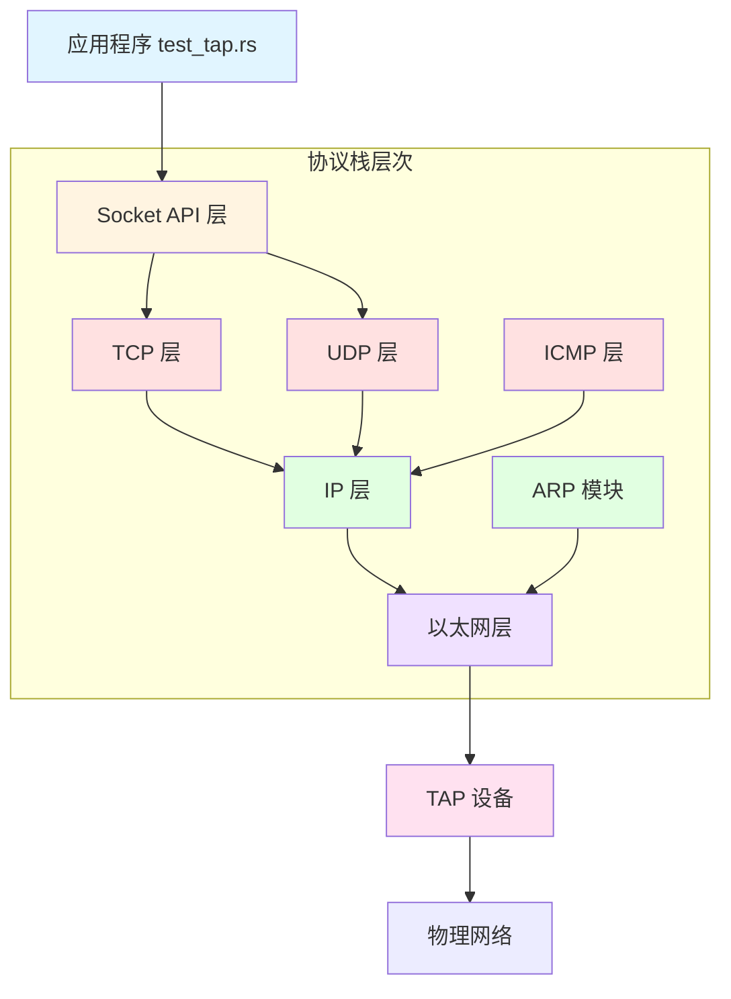
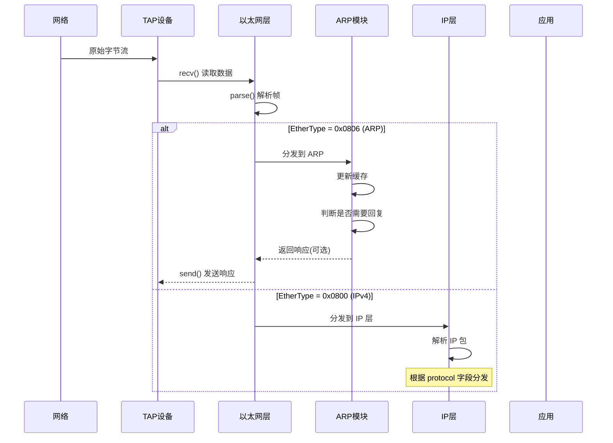
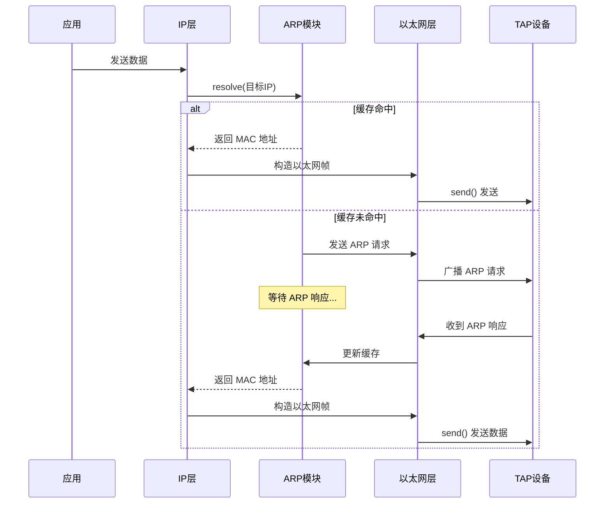

# TCP/IP 协议栈实现进度

## 项目概览

这是一个用 Rust 从零实现的 TCP/IP 协议栈，用于学习网络协议原理。

## 当前架构



## 数据包处理流程

### 接收流程



### 发送流程



## 已完成功能 ✅

### 1. 项目基础设施
- ✅ Cargo 项目配置
- ✅ 错误类型定义 (`StackError`)
- ✅ Tracing 日志框架
- ✅ 模块结构

### 2. 网络接口层
- ✅ `NetworkDevice` trait
- ✅ `TapDevice` 实现（TAP 设备封装）
- ✅ `NetworkInterface` 结构
- ✅ IP 地址配置

### 3. 以太网层
- ✅ `EthernetFrame` 解析
- ✅ `EthernetFrame` 构造
- ✅ `EtherType` 枚举
- ✅ 帧分类和分发

### 4. ARP 协议
- ✅ `ArpPacket` 解析
- ✅ `ArpPacket` 构造（请求/响应）
- ✅ `ArpCache` 缓存机制
- ✅ `ArpModule` 请求处理
- ✅ 自动回复 ARP 请求

### 当前可以做什么
- ✅ 创建 TAP 虚拟网卡
- ✅ 配置 IP 地址
- ✅ 接收和解析以太网帧
- ✅ 接收和解析 ARP 包
- ✅ 回复 ARP 请求
- ✅ 维护 ARP 缓存

## 正在进行 🚧

### ARP 缓存优化
- 添加 tracing 日志
- 实现 remove 方法

## 下一步计划 📋

### 短期目标：实现 ICMP (Ping)


**需要完成的任务：**

1. **IP 层核心功能** (任务 5)
   - `IpPacket` 数据结构和解析
   - IP 校验和计算
   - TTL 处理
   - 数据包分发

2. **ICMP 协议** (任务 6)
   - `IcmpPacket` 解析
   - Echo Request/Reply 处理
   - 自动回复 ping

### 中期目标：UDP 和 TCP

3. **UDP 协议** (任务 7)
   - UDP 数据报解析
   - 端口管理
   - 简单的 UDP echo

4. **TCP 基础** (任务 8-11)
   - TCP 段解析
   - 三次握手
   - 数据传输
   - 四次挥手

### 长期目标：完整协议栈

5. **Socket API** (任务 12)
   - 类似 BSD Socket 的接口
   - 支持 TCP/UDP

6. **集成和示例** (任务 13-14)
   - 协议栈主结构
   - ping 工具
   - traceroute 工具
   - echo 服务器/客户端

## 技术难点

### 已解决 ✅
- TAP 设备的 Packet Info 头部问题
- 字节序转换（网络字节序 vs 主机字节序）
- ARP 缓存的生命周期管理
- 以太网帧的解析和构造

### 待解决 ⚠️
- IP 分片和重组
- TCP 滑动窗口
- TCP 拥塞控制
- 重传机制
- 粘包处理

## 学习资源

- [RFC 791 - IP](https://tools.ietf.org/html/rfc791)
- [RFC 792 - ICMP](https://tools.ietf.org/html/rfc792)
- [RFC 793 - TCP](https://tools.ietf.org/html/rfc793)
- [RFC 768 - UDP](https://tools.ietf.org/html/rfc768)
- [RFC 826 - ARP](https://tools.ietf.org/html/rfc826)

## 测试方法

### 当前可测试
```bash
# 启动协议栈
sudo cargo run --bin test_tap

# 在另一个终端测试 ARP
sudo arping -I tap0 192.168.10.1
ping 192.168.10.2  # 触发 ARP 请求
```

### 即将可测试（完成 ICMP 后）
```bash
# ping 测试
ping 192.168.10.1

# traceroute 测试
traceroute 192.168.10.1
```

## 代码统计

- 总行数: ~1000 行
- 模块数: 8 个
- 已实现协议: ARP, 以太网
- 待实现协议: IP, ICMP, UDP, TCP

---

**最后更新**: 2025-01-25
**当前进度**: 30% (4/14 任务完成)
